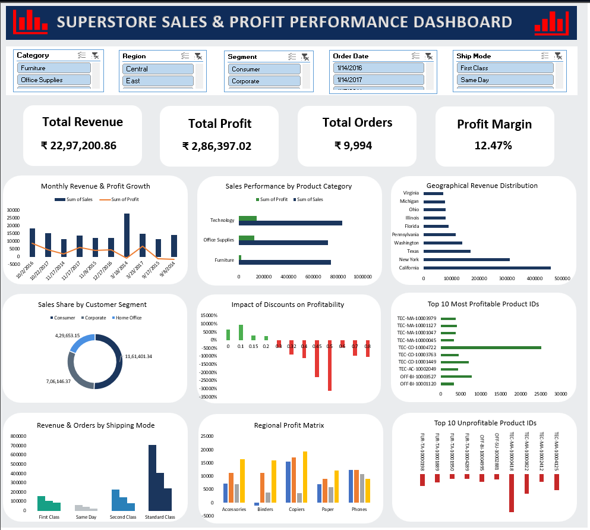

# Superstore-Sales-Profit-Performance-Dashboard
Interactive Excel dashboard analyzing Superstore sales and profit performance.

## 📊 Project Overview

This project is an interactive Excel dashboard created to analyze Superstore sales and profit performance. The dashboard transforms raw sales data into meaningful visual insights to understand business performance across categories, products, regions, customers, and time periods.

## 📸 Dashboard Preview

## 🛠️ Tools & Technologies

- Microsoft Excel
- Pivot Tables
- Pivot Charts
- Slicers
- Excel Formulas
- Data Cleaning
- Data Analysis
- Dashboard Design

## 📈 Dashboard Features

The dashboard provides an interactive analysis of:

- Total Sales
- Total Profit
- Total Orders
- Total Customers
- Sales Performance
- Profit Performance
- Regional Performance
- Category Performance
- Sub-Category Performance
- Product Performance
- Monthly Sales Trends
- Customer Analysis

## 📌 Key Performance Indicators

The dashboard includes important KPIs such as:

- Total Sales
- Total Profit
- Total Orders
- Total Customers
- Average Sales
- Average Profit

## 🔍 Key Insights

The dashboard helps identify:

- Top-performing categories and sub-categories
- Products generating the highest sales
- Products generating the highest profit
- Regional sales and profit performance
- Monthly sales trends
- Customer and product performance
- Areas with strong and weak profitability

## 🎯 Project Objective

The objective of this project is to analyze Superstore sales data using Microsoft Excel and create an interactive dashboard that presents important business insights in a clear and easy-to-understand format.

## 📂 Project Files

### Excel Dashboard

[Download Excel Dashboard](Superstore_Sales_Profit_Performance_Dashboard.xlsx)

### Dashboard Screenshot

The dashboard preview is available above for a quick overview of the project.

## 💡 Skills Demonstrated

- Data Cleaning
- Data Analysis
- Excel Dashboard Development
- Pivot Tables
- Pivot Charts
- Data Visualization
- KPI Development
- Business Insights
- Interactive Dashboard Design

## 👨‍💻 Author

**Sumit Tambitkar**

Aspiring Data Analyst

**Skills:** Excel | SQL | Power BI | Data Analysis
